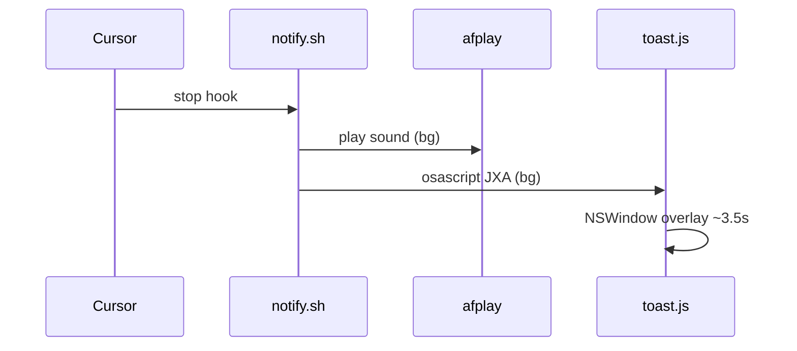

# Cursor Agent Done — sound + toast

Som + toast quando o agente do Cursor termina. Hook [`stop`](https://cursor.com/docs/agent/hooks). macOS: overlay JXA (sem Notification Center).

> **Obs:** doc feita com caveman em mode ultra — zero fluff — all done.

## Do clone ao toast

**1. Entra no projeto**
```bash
cd seu-repo
```

**2. Clone temporário + instala**
```bash
git clone https://github.com/SEU_USUARIO/cursor-agent-done-hook.git /tmp/cursor-agent-done-hook
/tmp/cursor-agent-done-hook/install.sh --cleanup-source
```
Cria `.cursor/hooks/` + mescla `hooks.json` (hook `stop`). Apaga `/tmp/cursor-agent-done-hook`.

**3. Recarrega hooks**  
Reinicia o Cursor ou salva `.cursor/hooks.json`.

**4. Teste manual**
```bash
sh .cursor/hooks/notify.sh
```
Som + toast `"Agent finished"` ~3.5s.

**5. Uso real**  
Abre o projeto no Cursor → agente trabalha → ao **parar** (`stop`):
- `afplay` Glass.aiff
- toast canto inferior direito

## O que o install faz

1. `./.cursor/hooks/` no projeto atual (não usa `~/.cursor`)
2. Copia `notify.sh` + `toast.js`
3. Mescla hook `stop` em `.cursor/hooks.json` (backup se já existir)
4. `chmod +x`
5. `--cleanup-source` remove o clone

## Arquivos

```text
seu-repo/
  .cursor/
    hooks.json
    hooks/
      notify.sh
      toast.js
```

## Fluxo interno



## Problemas

| Sintoma | Fix |
|--------|-----|
| Som ok, sem toast | `cat /tmp/cursor-toast.err` |
| Nada | Reinicia Cursor; confere `.cursor/hooks.json` |
| Hook não dispara | Cursor → Settings → Hooks → output **Hooks** |

## Customizar

| O quê | Onde |
|-------|------|
| Mensagem | `.cursor/hooks/notify.sh` |
| Duração | `toast.js` → `dateWithTimeIntervalSinceNow(3.5)` |
| Posição | `toast.js` → `marginRight`, `marginBottom` |
| Som macOS | `notify.sh` → path `.aiff` |

## Requisitos

- Cursor com hooks
- macOS: `afplay`, `osascript`, `python3`, `git`
- Linux: `notify-send` (+ `paplay`/`aplay` opcional)

Detalhes: [INSTALL.md](INSTALL.md) · [LICENSE](LICENSE)
