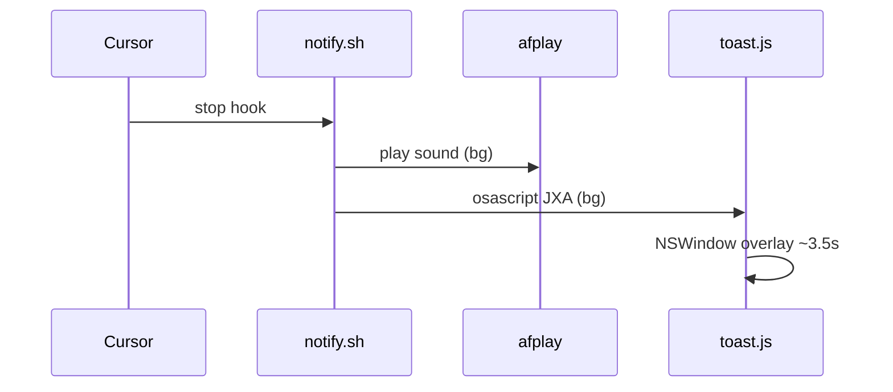

# Cursor Agent Done — Som + Toast quando o agente termina

Notificação sonora e visual para quando o **agente do Cursor** termina uma tarefa. Usa o hook [`stop`](https://cursor.com/docs/agent/hooks) do Cursor para disparar um som do sistema e um toast na tela — no macOS, via overlay nativo em JXA (sem passar pelo Notification Center, então funciona mesmo com notificações do Cursor silenciadas ou com o Foco ativado).

> **Obs:** doc feita em modo caveman-ultra — zero fluff, mas completa. Se algo não estiver aqui, provavelmente está em [INSTALL.md](INSTALL.md).

## Sumário

- [Por que usar](#por-que-usar)
- [Como funciona](#como-funciona)
- [Requisitos](#requisitos)
- [Do clone ao toast](#do-clone-ao-toast)
- [O que o install faz](#o-que-o-install-faz)
- [Arquivos](#arquivos)
- [Fluxo interno](#fluxo-interno)
- [Problemas](#problemas)
- [Customizar](#customizar)
- [Desinstalar](#desinstalar)
- [Privacidade](#privacidade)

## Por que usar

Tarefas de agente no Cursor podem levar de segundos a vários minutos. Sem notificação, o hábito comum é ficar alternando de aba pra checar se já terminou — o que quebra o foco. Com o hook `stop` configurado, o terminal toca um som e mostra um toast assim que o agente para, e você só volta pro editor quando for de fato preciso.

## Como funciona

O Cursor expõe pontos de extensão chamados *hooks*. O hook `stop` dispara sempre que o agente encerra a execução — seja porque terminou a tarefa, foi interrompido, ou parou por qualquer outro motivo. Este projeto registra um script (`notify.sh`) nesse hook; o script toca um som e, no macOS, abre uma janela overlay leve (via `osascript`/JXA) que some sozinha depois de alguns segundos.

## Requisitos

**macOS**
- `afplay` (nativo do macOS, toca o som)
- `osascript` (nativo do macOS, roda o JXA que desenha o toast)
- `python3` (usado por partes do script de notificação)
- `git` (para clonar o instalador)

**Linux**
- `notify-send` (obrigatório, gera a notificação)
- `paplay` ou `aplay` (opcional, para o som — sem eles a notificação visual ainda funciona, só sem áudio)

**Em ambos os casos:** um projeto já aberto no Cursor com suporte a hooks habilitado.

## Do clone ao toast

**1. Entra no projeto**

```bash
cd seu-repo
```

**2. Clone temporário + instala**

```bash
git clone https://github.com/SEU_USUARIO/cursor-agent-done-hook.git /tmp/cursor-agent-done-hook
/tmp/cursor-agent-done-hook/install.sh --cleanup-source
```

Isso cria a pasta `.cursor/hooks/` dentro do seu projeto, mescla a configuração do hook `stop` em `.cursor/hooks.json` (sem sobrescrever hooks que já existirem lá) e depois apaga `/tmp/cursor-agent-done-hook`, já que era só um clone temporário para rodar o instalador.

**3. Recarrega os hooks**

O Cursor precisa reler a configuração para o hook novo valer. Duas formas de forçar isso:
- Reiniciar o Cursor, ou
- Salvar o arquivo `.cursor/hooks.json` (um `Cmd+S` nele já é suficiente pra disparar o reload)

**4. Teste manual**

Antes de depender do gatilho automático, vale confirmar que o script funciona isolado:

```bash
sh .cursor/hooks/notify.sh
```

Se tudo estiver certo, você ouve um som e vê um toast com o texto `"Agent finished"` na tela por cerca de 3.5 segundos.

**5. Uso real**

Com o hook instalado e recarregado, o fluxo é automático: abre o projeto no Cursor, deixa o agente trabalhar em alguma tarefa e, quando ele **parar** (evento `stop`), dois processos disparam em segundo plano:

- `afplay` toca o som `Glass.aiff`
- um toast aparece no canto inferior direito da tela

Nenhum dos dois bloqueia o Cursor nem interrompe seu fluxo de trabalho — ambos rodam em background e o toast some sozinho.

## O que o install faz

O script `install.sh` automatiza a configuração inteira:

1. Cria a pasta `./.cursor/hooks/` **dentro do projeto atual** — importante notar que ele não mexe em `~/.cursor` (configuração global), só no projeto onde você rodou o comando.
2. Copia os dois arquivos necessários para essa pasta: `notify.sh` (o script que dispara som + toast) e `toast.js` (o script JXA que desenha o overlay no macOS).
3. Mescla a entrada do hook `stop` dentro de `.cursor/hooks.json`. Se esse arquivo já existir com outros hooks configurados, ele é preservado — o instalador só adiciona a entrada nova, e faz um backup do arquivo original antes de tocar nele.
4. Aplica `chmod +x` nos scripts, garantindo que sejam executáveis.
5. Com a flag `--cleanup-source`, remove o clone temporário em `/tmp/cursor-agent-done-hook` ao final, sem deixar lixo no sistema.

## Arquivos

Depois da instalação, a estrutura dentro do seu projeto fica assim:

```text
seu-repo/
  .cursor/
    hooks.json
    hooks/
      notify.sh
      toast.js
```

- **`hooks.json`** — configuração de hooks do Cursor, com a entrada `stop` apontando para `notify.sh`.
- **`notify.sh`** — orquestra a notificação: dispara o som e chama `toast.js`.
- **`toast.js`** — script JXA executado via `osascript`, responsável por desenhar a janela overlay no macOS.

## Fluxo interno



Quando o Cursor dispara o evento `stop`, ele chama `notify.sh`. Esse script, por sua vez, inicia dois processos em paralelo e em background (por isso o Cursor não trava esperando): o `afplay` toca o som, enquanto `toast.js` é invocado via `osascript` para desenhar uma `NSWindow` overlay que fica visível por ~3.5 segundos e desaparece sozinha.

## Problemas

| Sintoma | Causa provável | Fix |
|--------|-----------------|-----|
| Som toca, mas o toast não aparece | Erro no script JXA (`toast.js`) | Rodar `cat /tmp/cursor-toast.err` para ver a mensagem de erro |
| Nada acontece (nem som, nem toast) | Hook não recarregado, ou `.cursor/hooks.json` mal configurado | Reiniciar o Cursor; conferir se a entrada `stop` está presente em `.cursor/hooks.json` |
| Hook nunca dispara | Output de hooks desabilitado nas configurações do Cursor | Cursor → Settings → Hooks → habilitar output **Hooks** |
| Scripts sem permissão de execução | `chmod +x` não foi aplicado (instalação manual ou interrompida) | Rodar `chmod +x .cursor/hooks/notify.sh .cursor/hooks/toast.js` |
| Funciona no teste manual, mas não em uso real | Cache antigo do Cursor com a config anterior | Fechar o Cursor completamente (não só a janela) e reabrir |

## Customizar

| O quê | Onde |
|-------|------|
| Texto da mensagem | `.cursor/hooks/notify.sh` |
| Duração do toast | `toast.js` → `dateWithTimeIntervalSinceNow(3.5)` (altere o valor em segundos) |
| Posição na tela | `toast.js` → variáveis `marginRight` e `marginBottom` |
| Som no macOS | `notify.sh` → caminho do arquivo `.aiff` (qualquer som do sistema em `/System/Library/Sounds/` funciona) |
| Som/notificação no Linux | `notify.sh` → chamada de `notify-send` / `paplay` |

Depois de editar qualquer um desses arquivos, rode `sh .cursor/hooks/notify.sh` de novo para validar a mudança antes de voltar a usar o agente normalmente.

## Desinstalar

Não há script de desinstalação automática — remover é manual e rápido:

1. Apague a pasta `.cursor/hooks/` do projeto (ou só os arquivos `notify.sh` e `toast.js`, se quiser manter outros hooks).
2. Remova a entrada do hook `stop` em `.cursor/hooks.json` (se o instalador tiver feito um backup antes de mesclar, ele pode ser usado para restaurar o arquivo original).
3. Reinicie o Cursor para aplicar a mudança.

## Privacidade

Os scripts rodam inteiramente local — `afplay`, `osascript` e `notify-send` são utilitários do sistema, sem chamadas de rede nem coleta de dados. O único artefato gerado é um log de erro opcional em `/tmp/cursor-toast.err`, usado para depuração.

---

Detalhes adicionais de instalação: [INSTALL.md](INSTALL.md) · Licença: [LICENSE](LICENSE)
